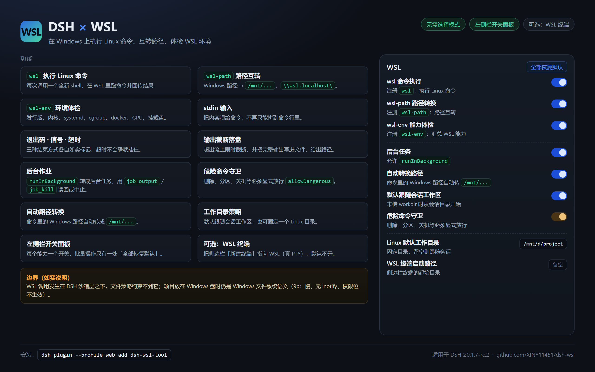

# dsh-wsl

[English](README.md) | [简体中文](README.zh-CN.md)

A model-facing **WSL** tool plugin for DeepSeek Harness (DSH). It lets an agent run
Linux commands through `wsl.exe` directly — no hand-written `.sh` scripts or `pwsh`
wrappers — and for command execution it essentially matches a native Linux DSH: a
real Linux kernel and bash, exit codes and signals, timeouts, truncation with spill
files, background jobs the built-in job tools read back, stdin, and automatic
Windows/WSL path translation.

Two limits are worth knowing before you rely on it. A `wsl` call runs below DSH's
sandbox, so a file policy does not confine it (see [Sandboxing](#sandboxing)); and a
project kept on a Windows drive keeps **Windows** filesystem semantics — no POSIX
permissions, case-insensitive names, no file-change notifications — at a fraction
of the speed (see [Notes](#notes)).



## Tools

The plugin registers three tools:

| Tool | Purpose |
|---|---|
| `wsl` | Run a Linux command and return `stdout`/`stderr` with exit-code, timeout and truncation markers. |
| `wsl-path` | Convert between Windows and WSL paths via `wslpath`. |
| `wsl-env` | Summarize the WSL environment (distros, kernel, cpu, mem, disk). |

### `wsl`

Runs:

```
wsl.exe [-d <distro>] -e bash -lc "cd <workdir> && <command>"
```

and returns `stdout`/`stderr` with `[exit code: N]` / `[killed by signal: ...]` /
`[timed out after Nms; the command was killed]` / `[output truncated: ...]` markers.

`<distro>` is the caller's `distro` argument, else `DSH_WSL_DISTRO`, else omitted
entirely so `wsl.exe` uses the **system default distribution** — that is what makes
the package portable to a machine that has no `Ubuntu-22.04`.

A script longer than the Windows command-line limit (32767 characters) is fed to
`wsl.exe [-d <distro>] -e bash -ls` on **stdin** instead, so long commands work
without any size ceiling.

Pass `stdin` to write text into the command (the default is `/dev/null`, so an
interactive command gets EOF), and `runInBackground: true` for work that outlives
the call: the command becomes a job in the host's registry, which the model then
reads with the **`job_output`** tool and stops with **`job_kill`** — no extra tool
is involved. Background jobs need `@deepseek-ai/dsh-tool-jobs` in the preset's
composition; without it the call fails with that instruction instead of silently
running in the foreground.

### `wsl-path`

Converts a path in either direction: `C:\Users\me\a.txt` -> `/mnt/c/Users/me/a.txt`
or `/home/me/a.txt` -> `\\wsl.localhost\Ubuntu-22.04\home\me\a.txt`. Direction is
auto-detected from the path, or forced with `direction: 'win' | 'linux'`.

### `wsl-env`

Returns the distribution list, the probed distro, kernel and architecture, CPU
count, memory and disk usage, and what the machine can actually **do**:

```
distro: Ubuntu-22.04 (system default)
Linux 6.6.87.2-microsoft-standard-WSL2 x86_64
nproc: 24
Ubuntu 22.04.5 LTS · WSL2 · cgroup v2
systemd: yes · docker: not installed
GPU: /dev/dxg present (GPU passthrough enabled) · nvidia-smi: GPU 0: NVIDIA GeForce RTX 5070 Laptop GPU
drives: /mnt/c /mnt/d
/etc/wsl.conf: [boot];systemd=true;[user];default=xiny; · .wslconfig: not set
launcher: WSL 版本: 2.6.3.0 · 内核版本: 6.6.87.2-1 · WSLg 版本: 1.0.71 · Windows: 10.0.26200.9457
```

so an agent can decide what is available before running commands: WSL1 vs WSL2,
whether systemd manages services, the cgroup version (matters for containers),
GPU passthrough, docker (installed / cli-only / daemon version), which drives are
mounted, and how `/etc/wsl.conf` and the Windows-side `.wslconfig` are
configured. Takes an optional `distro`.

Every fact is optional and degrades honestly: a probe that cannot run leaves its
line out, an empty value is stated (`docker: not installed`, `.wslconfig: not
set`), a failed probe is reported in the summary instead of being dropped, and an
unknown distro is an error rather than a partial answer. Note that `wsl --version`
is **localized**, so its labels are passed through as the launcher printed them
rather than parsed by name; the Direct3D/MSRDC/DXCore versions are omitted.

## Install

The published npm package is **`dsh-wsl-tool`**, not `dsh-wsl`: the registry
refuses `dsh-wsl` as too similar to the existing package `is-wsl`, and no token
or setting overrides that. The repository, the plugin and the market listing keep
the `dsh-wsl` name. The bundle patch points at its own entry by relative path, so
the folder under `node_modules` is free to differ — what has to match is the
specifier you install under.

1. Add the package to your DSH profile (`profiles/<profile>/package.json`):

   ```json
   { "dependencies": { "dsh-wsl-tool": "file:<path-to-this-repo>" } }
   ```

   or run `dsh plugin add --profile <profile> dsh-wsl-tool` to install from npm,
   or `dsh plugin add --profile <profile> file:<path-to-this-repo>` from a
   checkout (which names the dependency after this package).

2. Nothing else. The package's `cordis.patch.yml` inserts the `tool-wsl` row
   itself when the bundle is loaded, process-wide, so the three tools are
   available to every agent preset without further wiring. **There is no mode to
   pick and nothing to add to a preset** — the left-sidebar WSL panel arrives the
   same way.

   Do **not** also list `tool-wsl` in a preset: DSH registers tools by name, and
   the second registration fails with
   `tool "wsl" is already registered in this scope`. One row, from the bundle.

3. Restart DSH.

The settings panel is the one optional piece: its form needs
`@deepseek-ai/schemastery`, which most profiles already have (any plugin that
depends on it brings it in — add it to the profile's dependencies if yours does
not). Without it, the three tools and the panel's 「WSL 终端启动路径」 field work
as usual and only the switches are absent — the panel says so instead of waiting
forever.

## Compatibility

The manifest declares the DSH it needs — `"engines": { "dsh": ">=0.1.7-rc.2" }` —
which is the floor this section documents. The plugin market reads that
declaration from the published manifest and shows it as a requirement on the
entry (`DSH >=0.1.7-rc.2`), warning before an install or update onto an older
host; DSH itself ignores `engines`, so the declaration is advice, not a gate.
The `-rc.2` is load-bearing: `>=0.1.7` alone excludes the `0.1.7-rc.2` release
this line was verified on, and the market would then report the plugin as
incompatible with its own verified host.

Verified against DSH **0.1.7-rc.2** (earlier releases of this plugin were verified
on 0.1.5-rc.2): the tool schemas
pass DSH's own `assertSupportedJsonSchema`, the subprocess seam is exercised
against the real provider rather than a shim, and the background-job path is
checked against the real job registry, including the session-id ownership fence
that 0.1.7 tightened. `test/real-seam.mjs` is that check and it re-verifies a host
in about a minute, so point it at any DSH installation after an upgrade:

```sh
DSH_SUBPROCESS_LOCAL=/path/to/dsh/node_modules npm run test:real
```

A background job is owned by the calling session (`owner: exec.agent.id`), which
is what lets the model read it back with `job_output`/`job_kill` and what keeps
other sessions out; an execution with no agent starts the job unowned.

## The WSL panel (left sidebar)

The plugin ships a small client half: a **WSL** entry in the desktop app's left
sidebar, whose panel carries one switch per feature, each with a one-line
explanation.

| Switch | What it controls |
|---|---|
| `wsl` 命令执行 | registers the `wsl` tool |
| `wsl-path` 路径转换 | registers the `wsl-path` tool |
| `wsl-env` 能力体检 | registers the `wsl-env` tool |
| 后台任务 | whether `wsl` accepts `runInBackground` |
| 自动转换路径 | the default for the per-call `translatePaths` |
| 默认跟随会话工作区 | start in the session's directory instead of `~` when `workdir` is omitted. **On by default**: with it off, every relative path an agent writes lands in the Linux home, which is invisible from Explorer and grows the WSL disk image |
| Linux 默认工作目录 | a fixed Linux directory (for example `/mnt/d/project`) used when `workdir` is omitted. Filling it in wins over the switch above; clearing it goes back to following the session |
| WSL 终端启动路径 | the optional sidebar terminal's startup directory — `--cd <dir>` on the `terminal-controller` row of your **profile patch** (see [Optional: a WSL terminal in the sidebar](#optional-a-wsl-terminal-in-the-sidebar)). Empty clears it, and the panel reads the current value from the same file |
| 危险命令守卫 | whether a destructive command needs an explicit `allowDangerous` |

The panel edits the plugin's own configuration, so the same values can be written
by hand (`- id: tool-wsl` with `config:` in a profile patch) or by environment
variables. `lib/config.js` owns the precedence — **plugin configuration, then the
environment, then the built-in defaults** — and a switch left at its default lets
the layer below decide, which is why `DSH_WSL_WORKDIR=session` keeps working for
someone who never opened the panel.

「WSL 终端启动路径」 is the one exception: the sidebar terminal belongs to another
plugin, so that field edits your profile's patch layer instead — the file is backed
up before every write, only the terminal row's `args` line is rewritten, and the
result is read back and undone if it is not exactly that one line.

**A change takes effect at the next DSH start**: the host reads this configuration
once per mount, and the panel says so. Distro and timeout are values rather than
features — set them in the patch or with `DSH_WSL_DISTRO` / `DSH_WSL_TIMEOUT_MS`,
and the panel shows what is currently in effect.

The settings surface needs `@deepseek-ai/schemastery`, which the plugin declares as
an optional peer dependency: without it the three tools still run on their defaults
and only the panel is missing.

At the bottom of the panel there is one feedback entry, next to it a short
submission guide, and — see [Feedback](#feedback) — a 「复制插件信息」 button. The
button asks the host half on `/dsh-wsl-tool/info` for this plugin's own facts (name,
version and repository read from its manifest, Node, platform), the DSH build it is
running inside, and the WSL facts `wsl-env` reports (default distribution, kernel,
capability flags) — then copies the result together with the effective
configuration. Nothing here is a string a release has to remember to edit, and a
probe that fails says so instead of inventing a value.

## Optional: a WSL terminal in the sidebar

The desktop app's sidebar terminal can open WSL instead of a Windows shell. It is
**opt-in** — installing this plugin does not change which shell your terminals
open — and the patch that enables it ships in the package as
[`extras/terminal-wsl.patch.yml`](extras/terminal-wsl.patch.yml).

To turn it on, copy that entry into your profile's own patch layer
(`$DSH_HOME/profiles/<profile>/cordis.patch.yml`); a CLI launch can instead pass
`--patch <path to the installed file>`. It applies at the next app start.

The panel can set the startup directory for you: 「WSL 终端启动路径」 (beside 「默认
Linux 工作目录」) reads the current value out of that file and writes `--cd <dir>` onto
the row's `args` line — backing the patch up first, changing only that one line, and
checking what landed before it is kept. Clearing the field removes the flag, which puts
the terminal back on the session workspace (the Windows directory it is started from,
translated to `/mnt/…`); `~` pins it to the Linux home. It takes effect at the next app
start too.

```yaml
- id: terminal-controller
  config:
    shell:
      path: 'C:\Windows\System32\wsl.exe'
      name: WSL
      args: ['-e', 'bash', '-l']
```

- The sidebar's 新建终端 list is built from the composed `terminal-controller`
  row: it lists the configured `shell` first and keeps the shells it discovers
  (`powershell`, `cmd`, `bash`, …) selectable. The picker is core UI, so overriding
  that row is the supported way in — which is also why this cannot be a plain
  plugin entry.
- No distribution is pinned, so `wsl.exe` follows the system default — the same
  rule the tools use when `DSH_WSL_DISTRO` is unset. Add `-d <name>` to `args` to
  pin one.
- The session workspace is a Windows path that `wsl.exe` translates, so the
  terminal opens in `/mnt/<drive>/…` exactly like the Windows shells do; and it is
  a real PTY (`xterm-256color`), so full-screen programs work.
- An id-targeted patch replaces that row's whole config, so restate anything else
  you had set on it (terminal limits, scrollback, a custom `shellCandidates` list).

## `wsl` parameters

| Param | Required | Type | Notes |
|---|---|---|---|
| `command` | yes | string | Linux command to execute |
| `description` | yes | string | short UI label |
| `workdir` | no | string | Linux path (`/home/me`, `~/src`) or Windows path, default `~` |
| `timeoutMs` | no | number | timeout in milliseconds, default 600000 (10 min); the process is killed and the result marked as timed out |
| `distro` | no | string | WSL distribution; defaults to the system default distribution |
| `env` | no | object | extra environment variables to export (keys must be valid shell names) |
| `stdin` | no | string | text written to the command stdin (UTF-8) before it runs |
| `runInBackground` | no | boolean | run as a job and return its id immediately; read with `job_output`, stop with `job_kill` |
| `allowDangerous` | no | boolean | set `true` to run destructive commands |
| `translatePaths` | no | boolean | default `true`; set `false` to pass `command` through verbatim |

## Configuration

| Environment variable | Default | Effect |
|---|---|---|
| `DSH_WSL_DISTRO` | (system default) | Pin the distribution for every call. |
| `DSH_WSL_TIMEOUT_MS` | `600000` | Default deadline for a model-issued command; `timeoutMs` overrides it per call. |
| `DSH_WSL_MAX_TIMEOUT_MS` | `86400000` | Ceiling for a per-call `timeoutMs`, mirroring the platform shell tools' `maxTimeoutMs`. The default deadline obeys it too. |
| `DSH_WSL_WORKDIR` | `home` | Where a call starts without a `workdir`: `home` (the Linux `~`), `session` (the session working directory, i.e. `/mnt/<drive>/...` for a Windows checkout), or any explicit path. |
| `DSH_WSL_MAX_OUTPUT_BYTES` | `65536` | Per-stream in-memory window (1 KiB – 8 MiB). Also raises the spill ceiling when set above 64 MiB. |

An unparsable or out-of-range value falls back to the default: one bad variable
must not take all three tools down. Values are read once per mount, so a change
takes effect on restart.

## Notes

- Each call runs in a fresh shell — no cwd/variables/functions persist between calls.
- **stdin is `/dev/null` unless you pass `stdin`.** An interactive command (`read`,
  `cat`, a `sudo` password prompt without `-S`) otherwise gets EOF immediately and
  cannot wait for input; nothing in this plugin can prompt. A password passed via
  `stdin` is recorded in the session transcript.
- The default `workdir` is `~`; set `DSH_WSL_WORKDIR=session` to start in the
  session's working directory instead (see Configuration).
- The distro is the caller's `distro`, else `DSH_WSL_DISTRO`, else the system
  default; there is no hardcoded fallback name.
- An unknown distro is reported as a clear error (`distribution "X" is not registered`) instead of a raw `-1` exit code, and any other launcher failure (`Wsl/Service/WSL_E_*`) is surfaced with its code rather than passed off as the command's own exit status.
- **A background job outlives the call.** `runInBackground: true` returns a job id (`wsl-N`) immediately and registers the work with the host's job registry, so `job_output` reads it (with the same markers as a foreground call) and `job_kill` stops it. The 10-minute default deadline does **not** apply in the background; an explicit `timeoutMs` still does. A non-zero exit is reported as `completed` with the exit code in the detail, exactly like the foreground rendering.
- Windows paths in `command` and `workdir` are translated to `/mnt/...` automatically:
  - `C:\Users\me\a.txt` -> `/mnt/c/Users/me/a.txt`, and paths containing spaces work in either slash style and with several paths on one line: `C:\Program Files\Git`, `C:/Program Files/Git`, `C:\Program Files (x86)\Steam` and `cp C:\a.txt D:\b.txt` (both paths are translated) all behave;
  - `\\wsl.localhost\<distro>\home\x` and `\\wsl$\<distro>\home\x` -> `/home/x`;
  - text that only *looks* like a drive path is left alone: a single lowercase letter followed by `/` (`a:/b`), a drive letter inside another expression (`sed "s/C:\x/y/"`), and a drive-like segment inside a URL;
  - set `translatePaths: false` when the path belongs to a **Windows** program launched through interop — WSL does not translate `/mnt/c/...` back, so `notepad.exe C:\file.txt` needs its original spelling. This affects `command` only; `workdir` is always translated.
- A `~` in `workdir` or in a `wsl-path` argument is expanded by the shell (`~/my dir` works). Any other path is single-quoted, so `$VAR` inside a path is **not** expanded.
- Output is capped at 64 KiB per stream. The tail is kept and the marker names the spill file holding the **complete** stream, so nothing is unrecoverable:

  ```
  [stdout truncated: at most the last 65536 of 1288895 bytes were kept; full stream: C:\...\stdout.log]
  ```
- **Host shell facts are forwarded into the distro**, because WSL does not pass Windows environment variables across on its own: `DSH_SESSION_ID`, `DSH_SHELL` and `DSH_HOME` (translated to its `/mnt/...` view) are exported ahead of the command, so a script sees the same session facts the platform's own shell tools inject. They are resolved **per call** from the host's `shellEnv` registry — the same source the other shell tools read — because they are session-scoped, not host constants; reading the host's own `process.env` finds nothing and silently forwards nothing. **`DSH_WEB_URL` is deliberately not forwarded** — it is a `127.0.0.1` URL for the Windows-side server, and in the default NAT networking mode WSL cannot reach Windows loopback (measured: HTTP 000 on both `127.0.0.1` and the host IP, which the server does not bind either). An explicit `env` entry always overrides a forwarded one.
- `timeoutMs` defaults to 10 minutes so a wedged `wsl.exe` cannot hang the call forever; pass a larger value for genuinely long work, up to the `DSH_WSL_MAX_TIMEOUT_MS` ceiling (24 h by default) — a slip of the keyboard cannot mean "never time out". The value reported back is always the deadline actually armed. The timeout also kills the Linux-side process (the provider uses `taskkill /T /F` on Windows).
- `wsl-env` also states where the session's own files live, and whether that is a Windows drive mount:

  ```
  workspace: /mnt/d/DSHworkarea (Windows drive mount /mnt/d — builds, installs and git are much slower here; prefer a path under /home when it matters)
  ```

  It is worth believing. Measured on the author's machine: a 128 MB sequential write
  ran at ~2.1 GB/s on ext4 against ~247 MB/s on `/mnt/d`, and creating 400 small
  files took under 10 ms against 0.72 s (a later re-run: 884 vs 116 MB/s, and 13 ms
  against 745 ms — the ratios hold at roughly 8× and 50×).

  It is not only slower. `/mnt/<drive>` is a 9p (drvfs) mount, so it keeps **Windows**
  filesystem semantics: `chmod`/`chown` do not stick (a `chmod 600` reads back as
  `777`), names are case-insensitive (so a case-sensitive import only fails on Linux
  CI), symlinks and the executable bit are synthetic, and **inotify does not work at
  all** — a watcher inside the distro receives no events for writes from either side
  (measured with an inotify probe on `/mnt/d`: zero events for a Windows-side write
  and for a Linux-side write, while the same probe on ext4 reported create, modify
  and close-write). Dev servers, `--watch` modes and file-watching tests are
  therefore blind on a Windows drive. Keep a project under `/home` when it matters:
  it recovers real semantics, real watch events, and the speed above.
- Destructive commands are refused unless the call passes `allowDangerous: true`:
  - **any recursive delete** — `rm -r`, `rm -rf`, `rm -r -f`, `rm -R --force`, `rm --recursive` — because with stdin on `/dev/null` nothing prompts, so `rm -r tree` deletes silently. Each `rm` invocation is judged on its own command segment, so `rm a -f; rm b -r` cannot combine into a pass;
  - `dd` onto a block device, `mkfs`, partitioning/wiping tools (`fdisk`, `parted`, `wipefs`, `mkswap`, …), power control (`shutdown`, `reboot`, `systemctl reboot`, …), redirection onto a block device, and fork bombs;
  - the guard tolerates the ways a command word can be spelled (`sudo rm -r -f`, `bash -c "rm -rf /"`, `find . -exec rm -rf {} +`, `rm$IFS-rf`, `\rm -rf`, `$(which rm) -rf`) but matches device/power tools at **command position**, so inspecting them is fine: `man fdisk`, `grep -rn reboot /var/log/syslog` and `echo "the mkfs tool formats disks"` all run.
- Repeated launcher noise is stripped from stderr: the localhost-proxy warning and procps' `screen size is bogus` line.
- Uses `wsl.exe -e` (`--exec`) so quoting and `$VAR` expansion behave like a normal shell; the default `--` pass-through mangles single quotes and variables.

## Sandboxing

DSH's file sandbox is enforced at two points: the shell executors
(`@deepseek-ai/dsh-bash-sandbox`, `-pwsh-sandbox`, which wrap the exact argv
through `ctx.sandbox`) and the filesystem service (`@deepseek-ai/dsh-fs-sandbox`,
a policy fence on the two mutations). **`wsl` is in neither.** It spawns
`wsl.exe` through the host `subprocess` service, below that layer, so a
`workspace-write` policy does not confine it: it can write anywhere the Linux
side can, and anywhere under `/mnt/<drive>` that Windows permits.

That is not a gap this plugin can close by "joining" the sandbox. On Windows the
sandbox resolves to an ACL / restricted-token runner, while the file work happens
inside the Linux kernel: a write to `/home/...` touches the distro's own
filesystem image, which no Windows token constrains, and a write to `/mnt/c/...`
travels through the filesystem bridge, where ACL enforcement is not something to
rely on. Wrapping `wsl.exe` would confine the launcher, not the writes — and a
false sense of isolation is worse than a documented absence. (The platform's own
`dsh-fs-sandbox` is candid about its own limits too: "containment, not a security
boundary".)

What `wsl` does have is the destructive-command guard described above: a
deterministic refusal list, not a kernel boundary. Treat this tool as able to
touch anything your WSL installation can, and grant it accordingly.

## Install from the plugin list

The package declares a `dsh.bundle` manifest (see `package.json`), so once the
repository is listed it can be installed by name, e.g.
`dsh plugin add dsh-wsl-tool`, and storefronts will offer it for one-click
install. Installing from a local path (`file:`) as shown above keeps working
either way.

## How it works

The plugin is a cordis module that injects the host-plane `tools` and
`subprocess` registries. `index.js` is only the entry point; the implementation
is split by concern:

| Module | Responsibility |
|---|---|
| `lib/config.js` | Defaults and environment overrides, resolved once per mount. |
| `lib/paths.js` | Shell quoting and Windows -> WSL path translation. |
| `lib/guard.js` | The destructive-command rules. |
| `lib/result.js` | Launcher-noise filters, truncation facts, marker rendering. |
| `lib/diagnostics.js` | The `wsl-env` capability probe, its parser and its lines. |
| `lib/runner.js` | The single spawn path plus launcher-error classification. |
| `lib/tools/*.js` | The three tool definitions (schema, execute, presentCall). |

- `apply()` resolves the configuration and registers three tools, each with a
  JSON-schema parameter definition, an output schema, a `render` hook and an
  async `execute`.
- Every call goes through one spawn path (`runner.runWsl`): `wsl.exe -d <distro>
  -e bash -lc "<exports; cd workdir && command>"` through the host `subprocess`
  service, with stdout/stderr capped at the configured window (spilling to disk
  up to 64 MiB), a 3 s grace period after abort, and a deadline that defaults to
  10 minutes. The plugin's own probes get a 30 s ceiling so a wedged WSL service
  cannot hang a tool call forever.
- `env` entries are exported at the front of the command so they reach the
  Linux side reliably; Windows drive paths are rewritten to `/mnt/...` before
  the command is built.
- Output is returned as `{ exitCode, signal, timedOut, timeoutMs, truncated,
  stdout, stderr, stdoutTotalBytes, stdoutDroppedBytes, stderrTotalBytes,
  stderrDroppedBytes, stdoutSpillPath, stderrSpillPath, jobId }`; the `render` hook
  formats it into text with the markers listed above. The truncation marker
  quotes the window size rather than a count derived from the decoded text,
  which can be off by a byte or two when the window starts inside a multi-byte
  character.
- `jobId` is set only by a background start; every other path returns `null`, so
  the declared shape holds for both.
- Launching and settling are separate steps (`runner.launch` / `settle`) because
  a background job has to hand the registry a synchronous `cancel`/`done` pair
  while a foreground call simply awaits the same settle. A cancelled job maps the
  provider's early-termination rejection onto `killed`, since `JobHooks.done`
  must never reject.
- A destructive-command guard splits the command into `;`/`&`/`|`/newline
  segments, judges each `rm` invocation on its own flags, and matches the
  device/power tools at command position before dispatch.

The plugin publishes no services of its own and is inserted process-wide by its own
bundle patch, so it needs no realm — and no preset entry either.

## Development

The plugin is plain ESM with no build step or runtime dependencies outside the
DSH host plane. Iterate by pointing a profile dependency at the checkout:

```json
{ "dependencies": { "dsh-wsl-tool": "file:/path/to/dsh-wsl" } }
```

then restart DSH and call the tools from **any** session: the bundle patch registers
them process-wide, so no preset declares the row.

### Tests

```sh
npm test          # 499 host checks against real WSL (shim for ctx.subprocess) + 125 client checks
npm run test:real # the same checks against the REAL provider, plus the seam-fact suite
```

`npm test` substitutes only `ctx.subprocess`, with a shim that reproduces the
seam's bounded tail windows, spill files and termination ladder, and drives the
three tools against the real WSL installation. It covers path translation,
workdir quoting, the destructive guard, distro selection, exit-code/timeout/
truncation markers, `wsl-path`, `wsl-env`, argument validation, configuration
parsing, launcher-error classification, the returned shape against each declared
`output.schema`, and a token budget for the model-facing catalog.

`npm run test:real` runs that same suite against `LocalSubprocessRuntime` — the
shim must not drift from the real seam — and then `test/real-seam.mjs`, which
checks the facts a shim cannot vouch for (that `readFrom(0).nextOffset` is the
whole-stream total, that the spill file holds the complete stream, that a
timeout really kills the Linux side of `wsl.exe`) and validates every published
schema with DSH's own `assertSupportedJsonSchema`. It needs a DSH installation:

```sh
DSH_SUBPROCESS_LOCAL=/path/to/dsh/node_modules npm run test:real
```

### Syncing a profile

A `file:` dependency is a **copy**, so editing this checkout does not change what
DSH loads. After any change:

```sh
npm run sync                  # copies into ~/.dsh/profiles/desktop/node_modules/dsh-wsl
npm run sync -- /path/to/profiles/<profile>/node_modules/<your-key>
```

The target must be the folder your profile's dependency key created (the default
above is this checkout's own key); the plugin loads its entry by relative path, so
the folder name itself never matters.

then restart DSH — the plugin is imported once at load.

Releasing — the tag-triggered workflow, the npm name, and the catalog entry — is
documented in [`PUBLISHING.md`](PUBLISHING.md).

## Listing

The repository carries the `dsh-plugin` topic and is listed under the `wsl`
category of the awesome-dsh-plugin community list.

## Feedback

The sidebar panel ends with one feedback entry, and it sends nothing by itself.

- **A bug or a concrete request** →
  [open an issue](https://github.com/XINY11451/dsh-wsl/issues/new/choose). The
  templates ask for the environment once, which is the difference between a report
  that can be reproduced and a round trip.
- **Usage questions and ideas** →
  [Discussions](https://github.com/XINY11451/dsh-wsl/discussions).
- **GitHub unreachable?** The panel's 「复制插件信息」 button asks the host half for
  this package's own facts — name, version and repository straight out of its
  `package.json`, plus Node, the platform and the effective configuration — and
  copies them, together with the switch states the panel is already showing. Paste
  that into the issue's 「补充」 field and only the prose is left to write. The
  submission guide sits next to the button, in the panel.

Everything in that block is text you can read and edit before it goes anywhere: no
paths, host names or credentials are collected, and the plugin makes no request of
its own — the route the button reads is served by the local host, not the network.
Problems that belong elsewhere go to their own repositories — DSH itself →
[deepseek-harness](https://github.com/deepseek-ai/deepseek-harness/issues), the
market UI →
[dsh-market](https://github.com/dsh-market/dsh-market/issues), the catalog listing →
[awesome-dsh-plugin](https://github.com/awesome-dsh-plugin/awesome-dsh-plugin/issues).
The full routing table is in [SUPPORT.md](SUPPORT.md).
